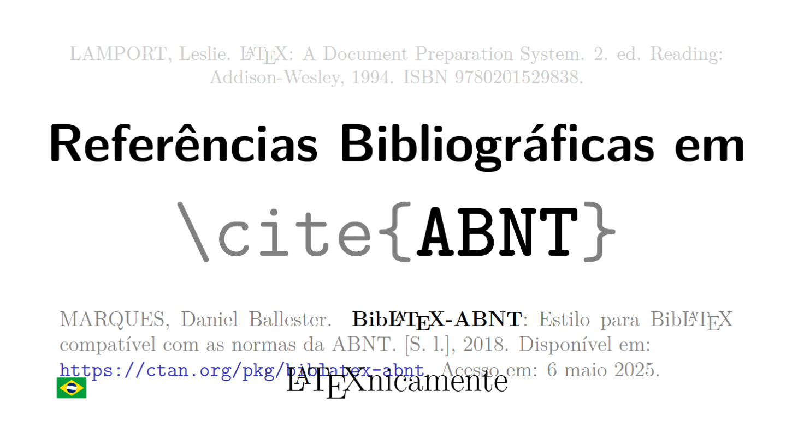

# Teste de LLMs: Recriando Capa do LaTeXnicamente

Este projeto avalia a capacidade de diferentes modelos de linguagem (LLMs) em reproduzir um documento LaTeX a partir de uma imagem de referência. O objetivo é comparar a qualidade e precisão do código LaTeX gerado por diferentes assistentes de IA ao receberem o mesmo prompt multimodal.

## Metodologia

O mesmo prompt foi apresentado a quatro produtos de IA distintos.

### Prompt

O prompt apresentado foi multimodal, consistindo em uma instrução em texto e uma referência visual. A parte textual é transcrita a seguir:

> Escreva um documento LaTeX, focando em clareza, objetividade e elegância, que reproduza esta imagem (16:9).

Essa instrução foi acompanhada da seguinte imagem em anexo:

[](https://youtu.be/YbFxi6Z_J4A)

Trata-se da _thumbnail_ [deste vídeo no Youtube](https://youtu.be/YbFxi6Z_J4A).

### Produtos

Este mesmo prompt multimodal foi apresentado a quatro produtos de IA distintos, quais sejam:
- Google Gemini 2.5 Pro;
- Google Gemini 3 Thinking;
- OpenAI GPT-5 Thinking Mini;
- Anthropic Claude 4.5 Sonnet Thinking;
- Perplexity (`Claude 4.5 Sonnet Thinking`);

## Resultados

### [`gemini3.tex`](./gemini3.tex) ✅

Compilando com `pdflatex gemini3.tex`, temos, como resultado:



### [`claude.tex`](./claude.tex) ✅

Compilando com `pdflatex claude.tex`, temos, como resultado:


### [`chatgpt.tex`](./chatgpt.tex) ⚠️

Compilando com `pdflatex chatgpt.tex`, como sugerido.

<details><summary>❌ Erros</summary>
<p>
Primeiro erro:

```plain
! Package tikz Error: You need to say \usetikzlibrary{calc} for coordinate calc
ulation.

 ...
l.84 \end{frame}
```
</p>
</details>

Seguindo a sugestão, a compilação termina com sucesso e temos, como resultado:


### [`perplexity.tex`](./perplexity.tex) ⚠️

Compilando com `pdflatex perplexity.tex`, como sugerido.

<details><summary>❌ Erros</summary>
<p>
Primeiro erro:

```plain
! Undefined control sequence.
l.33       2.\ ed. Reading: Addison\hyp
                                       {}Wesley, 1994. ISBN 9780201529838.};
?
```

Trata-se deste trecho do código:
https://github.com/hellmrf/test-llms-recreate-latexnicamente-cover/blob/657abcad926a1fc5558b7fc3e5ff644ddf5304a1/perplexity.tex#L31-L33

Removendo `\hyp{}` completamente, a compilação termina com sucesso e temos, como resultado:
</p>
</details>


### [`gemini.tex`](./gemini.tex) ⚠️

Compilando com `pdflatex gemini.tex`, como sugerido.

<details><summary>❌ Erros</summary>
<p>
Primeiro erro:

```plain
! LaTeX Error: There's no line here to end.
 ...
l.102 \end{frame}
```

Este erro é menos óbvio. Trata-se de um espaçamento incorreto:

https://github.com/hellmrf/test-llms-recreate-latexnicamente-cover/blob/b909667170f0ebfa84d9ff4b89db7b8d143ac180/gemini.tex#L85

Corrigindo para `\vspace{0.7em}`, a compilação termina com sucesso e temos, como resultado:
</p>
</details>


## Como Executar

### Pré-requisitos

- Docker
- ImageMagick (para conversão de PDF para PNG)
- [just](https://github.com/casey/just) (task runner)

### Compilando os Documentos

Para compilar um documento específico:

```bash
just build <filename>
# ou
just b <filename>
```

Por exemplo:
```bash
just build claude
just b chatgpt
```

Para compilar e converter para PNG em um único comando:

```bash
just buildconvert <filename>
# ou
just bc <filename>
```

Para limpar todos os arquivos auxiliares gerados:

```bash
just clean
# ou
just c
```
Para limpar arquivos auxiliares gerados em arquivos específicos:

```bash
just clean chatgpt.tex gemini.tex
# ou
just c claude.tex
```

Para ver todos os comandos disponíveis:

```bash
just list
# ou
just ls
# ou
just help
```

## Autor

**Heliton Martins** ([@hellmrf](https://github.com/hellmrf))

Projeto criado para avaliar comparativamente a capacidade de geração de código LaTeX por diferentes LLMs comerciais.

