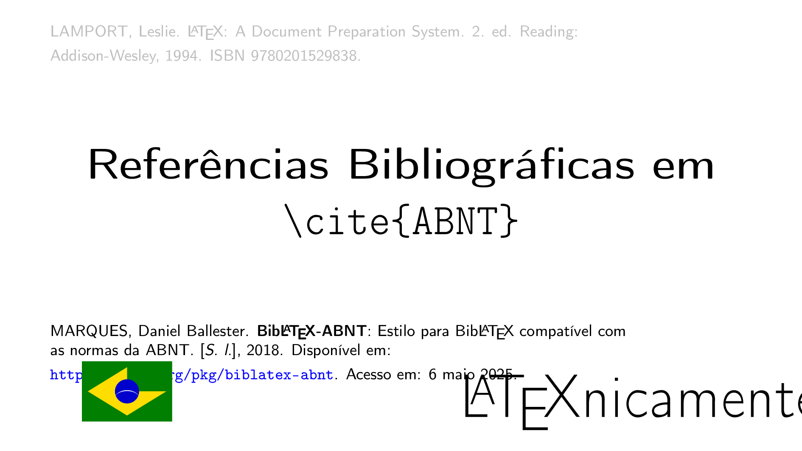
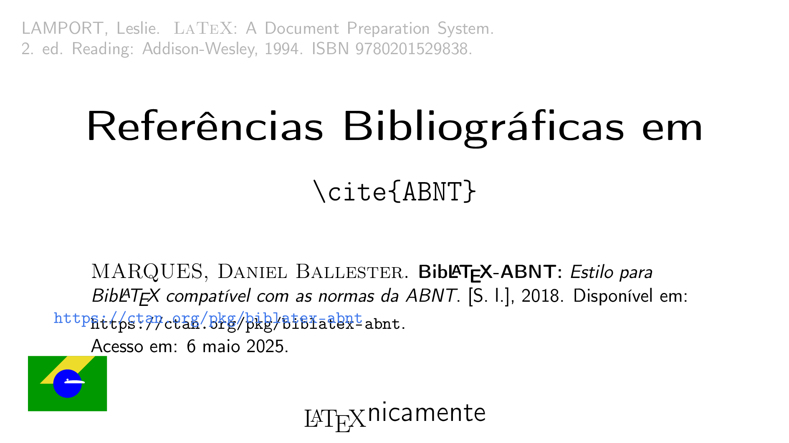
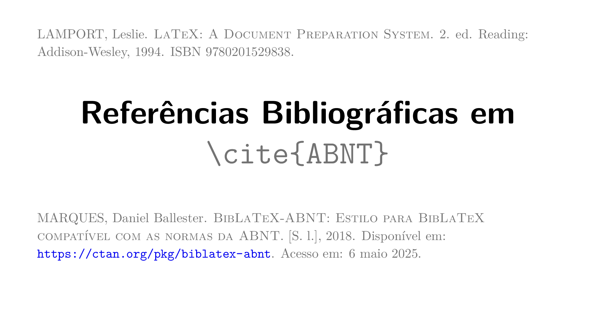

## Metodologia

O mesmo prompt foi apresentado a quatro produtos de IA distintos.

### Prompt

O prompt apresentado foi multimodal, consistindo em uma instrução em texto e uma referência visual. A parte textual é transcrita a seguir:
```plain
Escreva um documento LaTeX, focando em clareza, objetividade e elegância, que reproduza esta imagem (16:9).
```

Essa instrução foi acompanhada da seguinte imagem em anexo:

[](https://youtu.be/YbFxi6Z_J4A)

Trata-se da _thumbnail_ [deste vídeo no Youtube](https://youtu.be/YbFxi6Z_J4A).

### Produtos

Este mesmo prompt multimodal foi apresentado a quatro produtos de IA distintos, quais sejam:
- Google Gemini (`Gemini 2.5 Pro`)
- OpenAI ChatGPT (`GPT-5 Thinking Mini`);
- Anthropic Claude (`Claude 4.5 Sonnet Thinking`);
- Perplexity (`Claude 4.5 Sonnet Thinking`);

## Resultados


### [`claude.tex`](./claude.tex) ✅

Compilando com `pdflatex claude.tex`, temos, como resultado:




### [`chatgpt.tex`](./chatgpt.tex) ⚠️

Compilando com `pdflatex chatgpt.tex`, como sugerido.

Primeiro erro:

```plain
! Package tikz Error: You need to say \usetikzlibrary{calc} for coordinate calc
ulation.

 ...
l.84 \end{frame}
```

Seguindo a sugestão, a compilação termina com sucesso e temos, como resultado:




### [`perplexity.tex`](./perplexity.tex) ⚠️

Compilando com `pdflatex perplexity.tex`, como sugerido.

Primeiro erro:

```plain
! Undefined control sequence.
l.33       2.\ ed. Reading: Addison\hyp
                                       {}Wesley, 1994. ISBN 9780201529838.};
?
```

Trata-se deste trecho do código:
https://github.com/hellmrf/test-llms-recreate-latexnicamente-cover/blob/657abcad926a1fc5558b7fc3e5ff644ddf5304a1/perplexity.tex#L31-L33

Removendo `\hyp{}` completamente, a compilação termina com sucesso e temos, como resultado:


### [`gemini.tex`](./gemini.tex) ⚠️

Compilando com `pdflatex gemini.tex`, como sugerido.

Primeiro erro:

```plain
! LaTeX Error: There's no line here to end.
 ...
l.102 \end{frame}
```

Este erro é menos óbvio. Trata-se de um espaçamento incorreto:

https://github.com/hellmrf/test-llms-recreate-latexnicamente-cover/blob/b909667170f0ebfa84d9ff4b89db7b8d143ac180/gemini.tex#L85

Corrigindo para `\vspace{0.7em}`, a compilação termina com sucesso e temos, como resultado:



